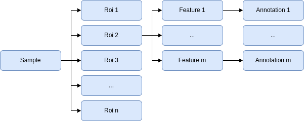
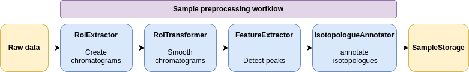

.. _sample-overview:

Sample workflow
===============

Four entities are used during the sample preprocessing stage:

- :py:class:`~tidyms2.core.models.Sample`
- :py:class:`~tidyms2.core.models.Roi`
- :py:class:`~tidyms2.core.models.Feature`
- :py:class:`~tidyms2.core.models.Annotation`

The following diagram showcases the relationships between these entities:

        
    Sample data level models

Sample
    Stores metadata from an individual measurement. It contains the required information to access the sample raw data
    including path to the raw data file, MS level, start acquisition time and end acquisition time. It also contains
    information associated with the assay design, such as sample group, sample order and sample batch. Refer to the
    :py:class:`API reference <tidyms2.core.models.Sample>` for detailed information.
Region Of Interest (ROI)
    Stores a region extracted from a sample raw data which may contain information about chemical species of interest.
    There is a many-to-one relationship between ROIS and a sample. An :term:`EIC` is a ROI in an :term:`LC-MS` assay.
    Refer to the :py:class:`API reference <tidyms2.core.models.Roi>` for detailed information.
Feature
    A feature defines where a chemical species is located in a ROI. There is a many-to-one relationship between features
    and a ROI. A chromatographic peak is a Feature in an :term:`LC-MS` assay. A Feature also defines how their properties,
    which we define as descriptors are computed. In a chromatographic peak for example, this is how peak area or peak
    width are computed. Refer to the :py:class:`API reference <tidyms2.core.models.Feature>` for detailed information.
Annotation
    An annotation maps a feature to the ROI and Sample that is associated with. It also provides chemical identity
    information such as its :term:`feature group`, ionic charge and isotopologue annotation. There is a one-to-one
    relationship between a feature and an annotation. Refer to the
    :py:class:`API reference <tidyms2.core.models.Annotation>` for detailed information.

Both ROI an Feature are abstract classes that must be implemented for each assay type (LC-MS, direct injection MS, ...).
Refer to the :ref:`developer-guide` for detailed information on how to create new ROI and Feature models.

The data integrity during sample processing is enforced by defining a set of operations allowed on these entities.
We define this as the data flow. The following operations are allowed during the sample preprocessing stage:

ROI extraction
    Extract ROIS from sample raw data. Implemented from :py:class:`~tidyms2.core.operators.RoiExtractor`.
ROI transformation
    Apply a transformation to a ROI. Implemented from :py:class:`~tidyms2.core.operators.RoiTransformer`.
Feature extraction
    Extract features from a ROI. It also provides descriptor-based filtering, allowing to keep or ignore features
    based on descriptor values such as peak width or :term:`SNR`. Implemented from
    :py:class:`~tidyms2.core.operators.FeatureExtractor`.
Feature transformer
    Apply a transformation to a feature. Implemented from :py:class:`~tidyms2.core.operators.FeatureTransformer`.
Sample operator
    Apply an arbitrary operation to all data extracted from a sample.

All of these operators must be implemented for each ROI-feature pair. Refer to the :ref:`developer-guide`
for detailed information on how to create new operators.

Each one of this operators are grouped into a :py:class:`~tidyms2.core.operators.Pipeline` which define the
sample preprocessing workflow. A pipeline ensures that the data flow is correct before applying executing any
operator. For example, feature extraction can be applied only after applying ROI extraction. The following
table shows the requirements for each operator:

.. list-table:: Sample operator requirements
   :widths: 25 25 25 25
   :header-rows: 1

   * - Operator
     - ROI extracted
     - Feature extracted
     - Isotopologue annotated
   * - RoiExtractor
     - No
     - No
     - No
   * - RoiTransformer
     - Yes
     - No
     - No
   * - FeatureExtractor
     - Yes
     - No
     - No
   * - FeatureTransformer
     - Yes
     - Yes
     - No
   * - IsotopologueAnnotator
     - Yes
     - Yes
     - No
   * - SampleOperator
     - 
     - 
     - 

The following diagram shows an example of how sample preprocessing steps are organized for LC-MS data:

        
    Example of an LC-MS sample preprocessing workflow

The :py:class:`~tidyms2.core.storage.SampleStorage` protocol is an interface to store data created during a sample
preprocessing workflow. The :py:class:`~tidyms2.storage.memory.OnMemorySampleStorage` class implements the sample
storage protocol and is suited for most sample processing workflows.

After the sample preprocessing workflow is applied to all samples, the second stage of the workflow, assay
preprocessing, starts.